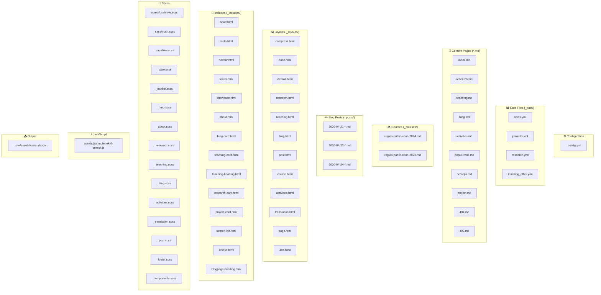
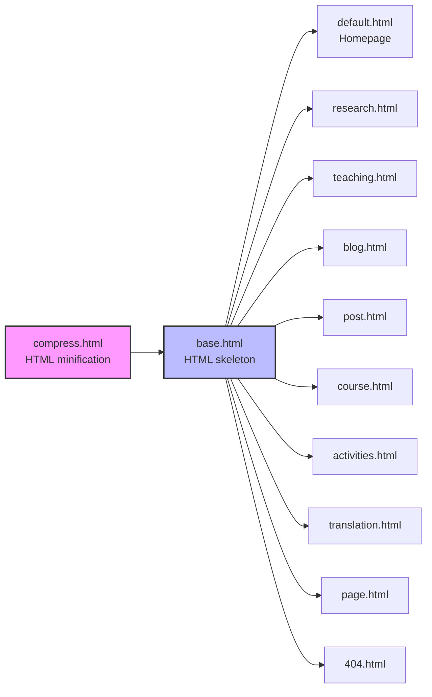
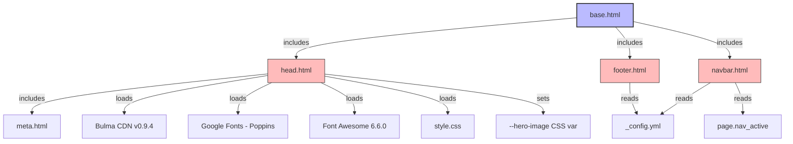
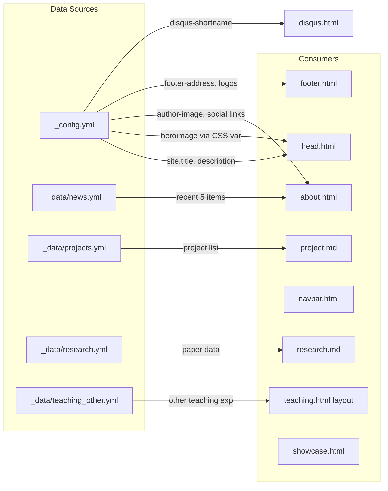

```mermaid
graph TD
    subgraph "Homepage (default.html)"
        default[default.html] -->|includes| showcase[showcase.html]
        default -->|includes| about[about.html]
        about -->|reads| news_data[_data/news.yml]
        about -->|reads| config1[_config.yml<br/>author-image, social links]
    end

    subgraph "Research (research.html)"
        research_l[research.html] -->|includes| disqus1[disqus.html]
        research_md2[research.md] -->|includes| research_card[research-card.html]
        research_md2 -->|reads| research_data[_data/research.yml]
    end

    subgraph "Teaching (teaching.html)"
        teaching_l[teaching.html] -->|includes| teaching_heading[teaching-heading.html]
        teaching_l -->|includes| teaching_card[teaching-card.html]
        teaching_l -->|includes| search_init1[search-init.html]
        teaching_l -->|reads| teaching_other[_data/teaching_other.yml]
        teaching_card -->|links to| courses[_courses/*.md]
    end

    subgraph "Blog (blog.html)"
        blog_l[blog.html] -->|includes| blogpage_heading[blogpage-heading.html]
        blog_l -->|includes| blog_card[blog-card.html]
        blog_l -->|includes| search_init2[search-init.html]
        blog_l -->|includes| disqus2[disqus.html]
        blog_card -->|iterates| posts[_posts/*.md]
    end

    subgraph "Post (post.html)"
        post_l[post.html] -->|includes| disqus3[disqus.html]
    end

    subgraph "Course (course.html)"
        course_l[course.html] -->|includes| disqus4[disqus.html]
    end

    subgraph "Translation / Activities"
        translation_l[translation.html] -->|includes| disqus5[disqus.html]
        activities_l[activities.html] -->|includes| disqus6[disqus.html]
    end

    search_init1 -->|loads| search_js[simple-jekyll-search.js]
    search_init2 -->|loads| search_js
    search_init1 -->|reads| search_json[search.json]
    search_init2 -->|reads| search_json
```

# 🗂️ 项目文件关系图 / File Dependency Map

> 自动生成于重构完成后，展示 Jekyll 站点所有文件之间的依赖关系。

## 总体架构 / Overall Architecture



## 布局继承链 / Layout Inheritance



## base.html 引用关系 / base.html Dependencies



## 各页面的 Include 依赖 / Page-specific Include Dependencies



## SCSS 模块结构 / SCSS Module Structure

```mermaid
graph TD
    style_entry["assets/css/style.scss<br/>(entry point, front matter)"] -->|@import| main["_sass/main.scss<br/>(import hub)"]
    
    main -->|@import| vars[_variables.scss<br/>colors, fonts, tag map]
    main -->|@import| base_scss[_base.scss<br/>scrollbar, selection, global]
    main -->|@import| navbar_scss[_navbar.scss<br/>opacity, hover, active]
    main -->|@import| hero_scss[_hero.scss<br/>gradient, blur bg]
    main -->|@import| about_scss[_about.scss<br/>#about section]
    main -->|@import| research_scss[_research.scss<br/>cards, tags, images]
    main -->|@import| teaching_scss[_teaching.scss<br/>banner, cards, course]
    main -->|@import| blog_scss[_blog.scss<br/>blog cards, hover]
    main -->|@import| activities_scss[_activities.scss<br/>accordion, details]
    main -->|@import| translation_scss[_translation.scss<br/>books section]
    main -->|@import| post_scss[_post.scss<br/>post content, page]
    main -->|@import| footer_scss[_footer.scss<br/>backtotop, credits]
    main -->|@import| components_scss[_components.scss<br/>search, project, contact]

    hero_scss -->|uses| css_var["var(--hero-image)<br/>set in head.html"]
    research_scss -->|uses| vars
    about_scss -->|uses| vars
    navbar_scss -->|uses| vars

    style style_entry fill:#ffd,stroke:#333,stroke-width:2px
    style main fill:#dfd,stroke:#333,stroke-width:2px
    style vars fill:#fdd,stroke:#333
```

## 数据流 / Data Flow



## 文件清单 / Complete File Inventory

| 类别 | 文件 | 用途 |
|------|------|------|
| **Config** | `_config.yml` | 全局配置 + footer地址/logo |
| **Data** | `_data/news.yml` | 首页新闻 |
| | `_data/projects.yml` | 项目列表 |
| | `_data/research.yml` | 研究论文数据 |
| | `_data/teaching_other.yml` | 其他教学经历 |
| **Layouts** | `compress.html` | HTML压缩 |
| | `base.html` | 统一HTML骨架 |
| | `default.html` | 首页 |
| | `research.html` | 研究页 |
| | `teaching.html` | 教学页 |
| | `blog.html` | 博客列表 |
| | `post.html` | 博客文章 |
| | `course.html` | 课程详情 |
| | `activities.html` | 活动页 |
| | `translation.html` | 翻译/科普页 |
| | `page.html` | 通用页面 |
| | `404.html` | 404错误页 |
| **Includes** | `head.html` → `meta.html` | HTML head |
| | `navbar.html` | 导航栏 (支持nav_active) |
| | `footer.html` | 页脚 (数据驱动) |
| | `showcase.html` | 首页hero |
| | `about.html` | 个人简介 |
| | `research-card.html` | 研究卡片模板 |
| | `teaching-card.html` | 教学卡片模板 |
| | `teaching-heading.html` | 教学页标题 |
| | `blog-card.html` | 博客卡片模板 |
| | `blogpage-heading.html` | 博客页标题 |
| | `project-card.html` | 项目卡片模板 |
| | `search-init.html` | 搜索初始化 (提取) |
| | `disqus.html` | 评论系统 (提取) |
| **SCSS** | `assets/css/style.scss` | 入口 (仅@import) |
| | `_sass/main.scss` | 导入枢纽 |
| | `_sass/_variables.scss` | 颜色/字体变量 |
| | `_sass/_base.scss` | 全局基础样式 |
| | `_sass/_navbar.scss` | 导航栏样式 |
| | `_sass/_hero.scss` | Hero区域样式 |
| | `_sass/_about.scss` | 关于区域样式 |
| | `_sass/_research.scss` | 研究页样式 |
| | `_sass/_teaching.scss` | 教学页样式 |
| | `_sass/_blog.scss` | 博客样式 |
| | `_sass/_activities.scss` | 活动页样式 |
| | `_sass/_translation.scss` | 翻译页样式 |
| | `_sass/_post.scss` | 文章页样式 |
| | `_sass/_footer.scss` | 页脚样式 |
| | `_sass/_components.scss` | 搜索/项目/联系 |
| **JS** | `assets/js/simple-jekyll-search.js` | 搜索引擎 |
| **Deprecated** | `_deprecated/` | 已弃用文件存档 |
