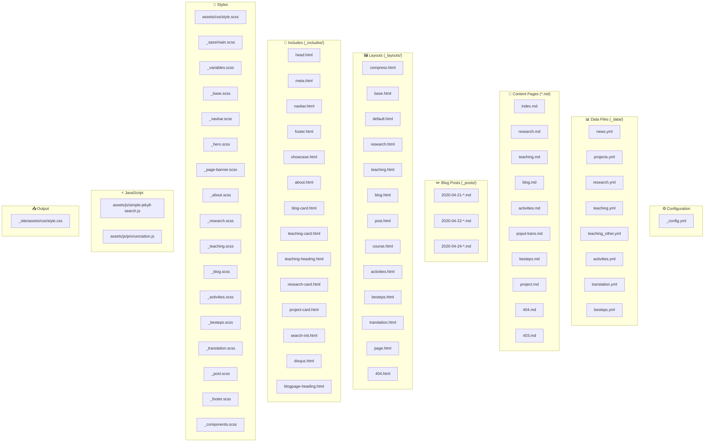
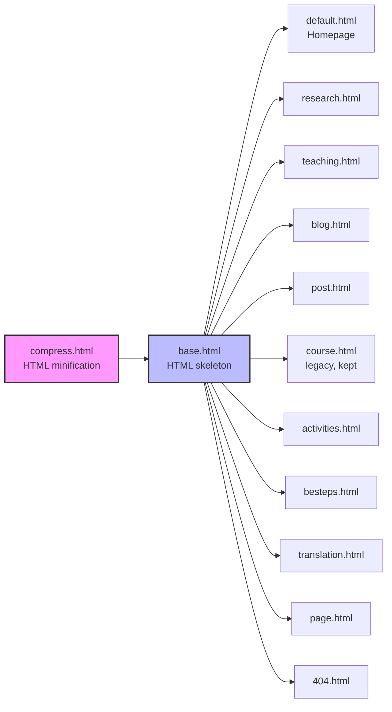
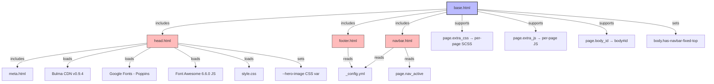
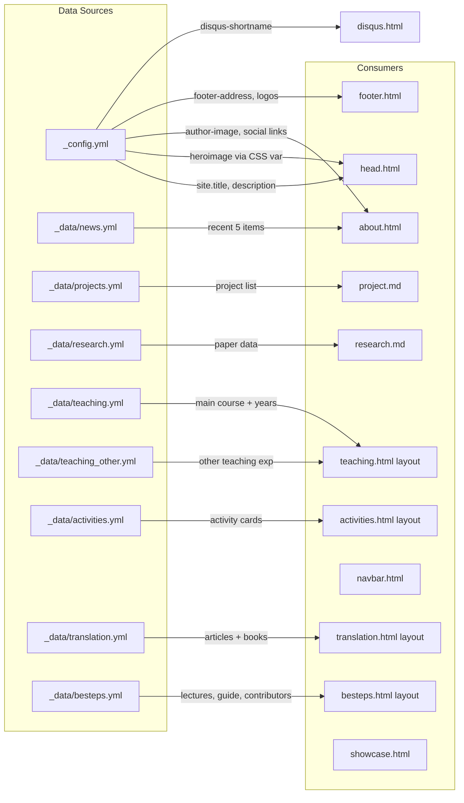

# 🗂️ 项目文件关系图 / File Dependency Map

> 最后更新：2026-03-02。展示 Jekyll 站点所有文件之间的依赖关系。

## 总体架构 / Overall Architecture

```mermaid
graph TB
    subgraph CONFIG["⚙️ Configuration"]
        _config[_config.yml]
    end

    subgraph DATA["📊 Data Files (_data/)"]
        news[news.yml]
        projects[projects.yml]
        research_data[research.yml]
        teaching_data[teaching.yml]
        teaching_other[teaching_other.yml]
        activities_data[activities.yml]
        translation_data[translation.yml]
        besteps_data[besteps.yml]
    end

    subgraph CONTENT["📝 Content Pages (*.md)"]
        index[index.md]
        research_md[research.md]
        teaching_md[teaching.md]
        blog_md[blog.md]
        activities_md[activities.md]
        popul_trans[popul-trans.md]
        besteps[besteps.md]
        project_md[project.md]
        err404[404.md]
        err403[403.md]
    end

    subgraph POSTS["✏️ Blog Posts (_posts/)"]
        post1[2020-04-21-*.md]
        post2[2020-04-22-*.md]
        post3[2020-04-24-*.md]
    end

    subgraph LAYOUTS["🖼️ Layouts (_layouts/)"]
        compress[compress.html]
        base[base.html]
        default[default.html]
        research_layout[research.html]
        teaching_layout[teaching.html]
        blog_layout[blog.html]
        post_layout[post.html]
        course_layout[course.html]
        activities_layout[activities.html]
        besteps_layout[besteps.html]
        translation_layout[translation.html]
        page_layout[page.html]
        layout404[404.html]
    end

    subgraph INCLUDES["🧩 Includes (_includes/)"]
        head[head.html]
        meta[meta.html]
        navbar[navbar.html]
        footer[footer.html]
        showcase[showcase.html]
        about[about.html]
        blog_card[blog-card.html]
        teaching_card[teaching-card.html]
        teaching_heading[teaching-heading.html]
        research_card[research-card.html]
        project_card[project-card.html]
        search_init[search-init.html]
        disqus[disqus.html]
        blogpage_heading[blogpage-heading.html]
    end

    subgraph SCSS["🎨 Styles"]
        style_entry[assets/css/style.scss]
        main_scss[_sass/main.scss]
        vars[_variables.scss]
        base_scss[_base.scss]
        navbar_scss[_navbar.scss]
        hero_scss[_hero.scss]
        page_banner_scss[_page-banner.scss]
        about_scss[_about.scss]
        research_scss[_research.scss]
        teaching_scss[_teaching.scss]
        blog_scss[_blog.scss]
        activities_scss[_activities.scss]
        besteps_scss[_besteps.scss]
        translation_scss[_translation.scss]
        post_scss[_post.scss]
        footer_scss[_footer.scss]
        components_scss[_components.scss]
    end

    subgraph JS["⚡ JavaScript"]
        search_js[assets/js/simple-jekyll-search.js]
        pronunciation_js[assets/js/pronunciation.js]
    end

    subgraph OUTPUT["📤 Output"]
        style_css[_site/assets/css/style.css]
    end
```

## 布局继承链 / Layout Inheritance

```mermaid
graph LR
    compress[compress.html<br/>HTML minification] --> base[base.html<br/>HTML skeleton]
    base --> default[default.html<br/>Homepage]
    base --> research_layout[research.html]
    base --> teaching_layout[teaching.html]
    base --> blog_layout[blog.html]
    base --> post_layout[post.html]
    base --> course_layout[course.html<br/>legacy, kept]
    base --> activities_layout[activities.html]
    base --> besteps_layout[besteps.html]
    base --> translation_layout[translation.html]
    base --> page_layout[page.html]
    base --> layout404[404.html]

    style compress fill:#f9f,stroke:#333,stroke-width:2px
    style base fill:#bbf,stroke:#333,stroke-width:2px
```

## base.html 引用关系 / base.html Dependencies

```mermaid
graph TD
    base[base.html] -->|includes| head[head.html]
    base -->|includes| navbar[navbar.html]
    base -->|includes| footer[footer.html]
    base -->|supports| extra_css["page.extra_css → per-page SCSS"]
    base -->|supports| extra_js["page.extra_js → per-page JS"]
    base -->|supports| body_id["page.body_id → body#id"]
    base -->|sets| body_class["body.has-navbar-fixed-top"]
    head -->|includes| meta[meta.html]
    head -->|loads| bulma[Bulma CDN v0.9.4]
    head -->|loads| fonts[Google Fonts - Poppins]
    head -->|loads| fa[Font Awesome 6.6.0 JS]
    head -->|loads| style_css[style.css]
    head -->|sets| css_var["--hero-image CSS var"]
    
    navbar -->|reads| _config[_config.yml]
    navbar -->|reads| page_nav["page.nav_active"]
    footer -->|reads| _config
    
    style base fill:#bbf,stroke:#333,stroke-width:2px
    style head fill:#fbb,stroke:#333
    style navbar fill:#fbb,stroke:#333
    style footer fill:#fbb,stroke:#333
```

## 各页面的 Include 依赖 / Page-specific Include Dependencies

```mermaid
graph TD
    subgraph "Homepage (default.html)"
        default[default.html] -->|includes| showcase[showcase.html]
        default -->|includes| about[about.html]
        default -->|loads| pronunciation_js[pronunciation.js]
        about -->|reads| news_data[_data/news.yml]
        about -->|reads| config1[_config.yml<br/>author-image, social links]
        about -->|Web Speech API| name_audio["Name pronunciation 🔊"]
    end

    subgraph "Research (research.html)"
        research_l[research.html] -->|includes| disqus1[disqus.html]
        research_md2[research.md] -->|includes| research_card[research-card.html]
        research_md2 -->|reads| research_data[_data/research.yml]
    end

    subgraph "Teaching (teaching.html)"
        teaching_l[teaching.html] -->|reads| teaching_data[_data/teaching.yml]
        teaching_l -->|reads| teaching_other[_data/teaching_other.yml]
        teaching_l -->|includes| disqus_t[disqus.html]
        teaching_l -->|accordion| details["&lt;details&gt; per year"]
    end

    subgraph "Activities (activities.html)"
        activities_l[activities.html] -->|reads| activities_data[_data/activities.yml]
        activities_l -->|page-banner| banner1[page-banner component]
        activities_l -->|includes| disqus6[disqus.html]
    end

    subgraph "BESTEPS (besteps.html)"
        besteps_l[besteps.html] -->|reads| besteps_data[_data/besteps.yml]
        besteps_l -->|page-banner --besteps| banner2[page-banner component]
        besteps_l -->|includes| disqus7[disqus.html]
    end

    subgraph "Translation (translation.html)"
        translation_l[translation.html] -->|reads| translation_data[_data/translation.yml]
        translation_l -->|page-banner| banner3[page-banner component]
        translation_l -->|uses| banner_title["page.banner_title (HTML safe)"]
        translation_l -->|includes| disqus5[disqus.html]
    end

    subgraph "Blog (blog.html)"
        blog_l[blog.html] -->|includes| blogpage_heading[blogpage-heading.html]
        blog_l -->|includes| blog_card[blog-card.html]
        blog_l -->|includes| search_init2[search-init.html]
        blog_l -->|includes| disqus2[disqus.html]
        blog_card -->|iterates| posts[_posts/*.md]
    end

    subgraph "Post (post.html)"
        post_l[post.html] -->|includes| disqus3[disqus.html]
    end

    search_init2 -->|loads| search_js[simple-jekyll-search.js]
    search_init2 -->|reads| search_json[search.json]
```

## SCSS 模块结构 / SCSS Module Structure

```mermaid
graph TD
    style_entry["assets/css/style.scss<br/>(entry point, front matter)"] -->|@import| main["_sass/main.scss<br/>(import hub)"]
    
    main -->|@import| vars[_variables.scss<br/>colors, fonts, tag map]
    main -->|@import| base_scss[_base.scss<br/>scrollbar, selection, global]
    main -->|@import| navbar_scss[_navbar.scss<br/>opacity, hover, active]
    main -->|@import| hero_scss[_hero.scss<br/>gradient, blur bg]
    main -->|@import| page_banner_scss[_page-banner.scss<br/>colored header strip]
    main -->|@import| about_scss[_about.scss<br/>#about, pronunciation, buttons]
    main -->|@import| research_scss[_research.scss<br/>cards, tags, images]
    main -->|@import| teaching_scss[_teaching.scss<br/>banner, accordion, card]
    main -->|@import| blog_scss[_blog.scss<br/>blog cards, hover]
    main -->|@import| activities_scss[_activities.scss<br/>card grid]
    main -->|@import| besteps_scss[_besteps.scss<br/>programme, guide, contributors]
    main -->|@import| translation_scss[_translation.scss<br/>articles, book cards]
    main -->|@import| post_scss[_post.scss<br/>post content, page]
    main -->|@import| footer_scss[_footer.scss<br/>backtotop, credits]
    main -->|@import| components_scss[_components.scss<br/>search, project, contact]

    hero_scss -->|uses| css_var["var(--hero-image)<br/>set in head.html"]
    page_banner_scss -->|uses| vars
    research_scss -->|uses| vars
    about_scss -->|uses| vars
    besteps_scss -->|uses| vars
    navbar_scss -->|uses| vars

    style style_entry fill:#ffd,stroke:#333,stroke-width:2px
    style main fill:#dfd,stroke:#333,stroke-width:2px
    style vars fill:#fdd,stroke:#333
```

## 数据流 / Data Flow

```mermaid
graph LR
    subgraph "Data Sources"
        config[_config.yml]
        news[_data/news.yml]
        projects[_data/projects.yml]
        research_yml[_data/research.yml]
        teaching_yml[_data/teaching.yml]
        teaching_other_yml[_data/teaching_other.yml]
        activities_yml[_data/activities.yml]
        translation_yml[_data/translation.yml]
        besteps_yml[_data/besteps.yml]
    end

    subgraph "Consumers"
        about[about.html] 
        project_page[project.md]
        research_page[research.md]
        teaching_page[teaching.html layout]
        activities_page[activities.html layout]
        translation_page[translation.html layout]
        besteps_page[besteps.html layout]
        navbar[navbar.html]
        footer[footer.html]
        head[head.html]
        showcase[showcase.html]
    end

    config -->|site.title, description| head
    config -->|heroimage via CSS var| head
    config -->|author-image, social links| about
    config -->|footer-address, logos| footer
    config -->|disqus-shortname| disqus[disqus.html]

    news -->|recent 5 items| about
    projects -->|project list| project_page
    research_yml -->|paper data| research_page
    teaching_yml -->|main course + years| teaching_page
    teaching_other_yml -->|other teaching exp| teaching_page
    activities_yml -->|activity cards| activities_page
    translation_yml -->|articles + books| translation_page
    besteps_yml -->|lectures, guide, contributors| besteps_page
```

## 文件清单 / Complete File Inventory

| 类别 | 文件 | 用途 |
|------|------|------|
| **Config** | `_config.yml` | 全局配置 + footer地址/logo |
| **Data** | `_data/news.yml` | 首页新闻 |
| | `_data/projects.yml` | 项目列表 |
| | `_data/research.yml` | 研究论文数据 |
| | `_data/teaching.yml` | 主课程数据 (年份/accordion) |
| | `_data/teaching_other.yml` | 其他教学经历 |
| | `_data/activities.yml` | 活动卡片数据 |
| | `_data/translation.yml` | 翻译/科普文章+书籍 |
| | `_data/besteps.yml` | BESTEPS 讲座/Guide/贡献者 |
| **Layouts** | `compress.html` | HTML压缩 |
| | `base.html` | 统一HTML骨架 (`has-navbar-fixed-top`, `body_id`, `extra_css/js`) |
| | `default.html` | 首页 (加载 pronunciation.js) |
| | `research.html` | 研究页 |
| | `teaching.html` | 教学页 (banner + accordion) |
| | `blog.html` | 博客列表 |
| | `post.html` | 博客文章 |
| | `course.html` | 课程详情 (legacy) |
| | `activities.html` | 活动页 (page-banner + 卡片网格) |
| | `besteps.html` | BESTEPS页 (page-banner--besteps + 两栏programme + guide card) |
| | `translation.html` | 翻译/科普页 (page-banner + 分节锚点) |
| | `page.html` | 通用页面 |
| | `404.html` | 404错误页 |
| **Includes** | `head.html` → `meta.html` | HTML head |
| | `navbar.html` | 导航栏 (id/href匹配高亮) |
| | `footer.html` | 页脚 (数据驱动) |
| | `showcase.html` | 首页hero |
| | `about.html` | 个人简介 (发音卡片 + 按钮居中在两栏下方) |
| | `research-card.html` | 研究卡片模板 |
| | `teaching-card.html` | 教学卡片模板 |
| | `teaching-heading.html` | 教学页标题 |
| | `blog-card.html` | 博客卡片模板 |
| | `blogpage-heading.html` | 博客页标题 |
| | `project-card.html` | 项目卡片模板 |
| | `search-init.html` | 搜索初始化 (提取) |
| | `disqus.html` | 评论系统 (提取) |
| **SCSS** | `assets/css/style.scss` | 入口 (仅@import) |
| | `_sass/main.scss` | 导入枢纽 (16 modules) |
| | `_sass/_variables.scss` | 颜色/字体变量 (`$color-primary: #5f8151`) |
| | `_sass/_base.scss` | 全局基础样式 |
| | `_sass/_navbar.scss` | 导航栏样式 |
| | `_sass/_hero.scss` | Hero区域样式 |
| | `_sass/_page-banner.scss` | 页面彩色横幅组件 (主题绿渐变, `--besteps` 变体) |
| | `_sass/_about.scss` | 关于区域样式 (发音卡片, 按钮, 社交图标) |
| | `_sass/_research.scss` | 研究页样式 |
| | `_sass/_teaching.scss` | 教学页样式 (banner, accordion `
`) |
| | `_sass/_blog.scss` | 博客样式 |
| | `_sass/_activities.scss` | 活动页样式 (卡片网格) |
| | `_sass/_besteps.scss` | BESTEPS样式 (两栏programme, guide card, contributors) |
| | `_sass/_translation.scss` | 翻译页样式 (文章行, 书籍卡片) |
| | `_sass/_post.scss` | 文章页样式 |
| | `_sass/_footer.scss` | 页脚样式 |
| | `_sass/_components.scss` | 搜索/项目/联系 |
| **JS** | `assets/js/simple-jekyll-search.js` | 搜索引擎 |
| | `assets/js/pronunciation.js` | 中文名发音 (Web Speech API) |
| **Deprecated** | `_deprecated/about_original.html` | 旧版 about 模板 |
| | `_deprecated/contact.html` | 旧版联系表单 |
| | `_deprecated/dropdown.html` | 旧版下拉菜单 |
| | `_deprecated/project_temp.html` | 旧版项目布局 |
| | `_deprecated/_courses/*.md` | 旧版课程详情页 (已改为数据驱动) |

## 设计决策备注 / Design Notes

- **Font Awesome 6.6.0 JS 版**：会将 `<i>` 替换为 `<svg>`，导致 `<i>` 上的 `id` 属性丢失。需要用 `` 包裹。
- **compress.html**：会破坏内联 `<script>` 标签中的代码。解决方案：将脚本提取到外部 `.js` 文件。
- **page.title vs banner_title**：Translation 页面用 `banner_title`（含 HTML）做横幅显示，`title`（纯文本）用于 meta 标签，避免 HTML 污染 SEO。
- **`has-navbar-fixed-top`**：`<body>` 必须加此 class 以配合 Bulma 固定导航栏的 padding-top 偏移。
- **page-banner 组件**：Activities / Translation / BESTEPS 页面使用统一的 `_page-banner.scss` 组件，BESTEPS 用 `--besteps` modifier 加深色调。
- **Teaching 数据驱动**：原先用 `_courses/` collection + 独立 markdown 页面，现改为 `_data/teaching.yml` + `
` accordion，课程文件归档到 `_deprecated/`。
