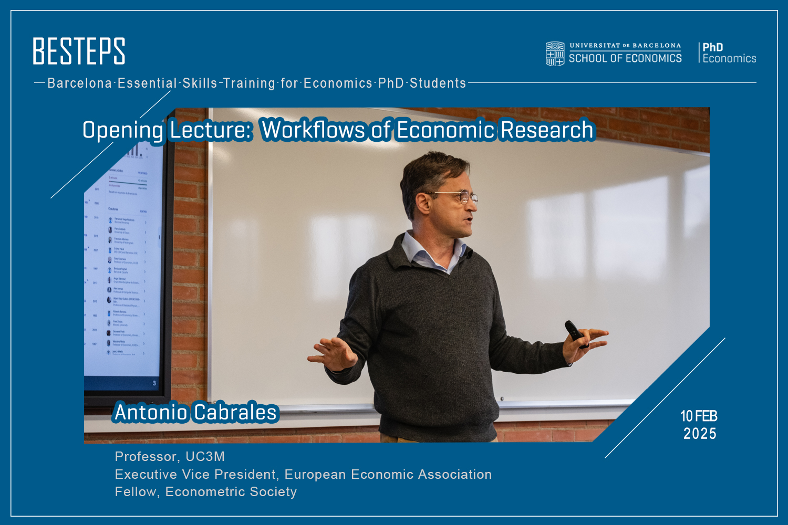
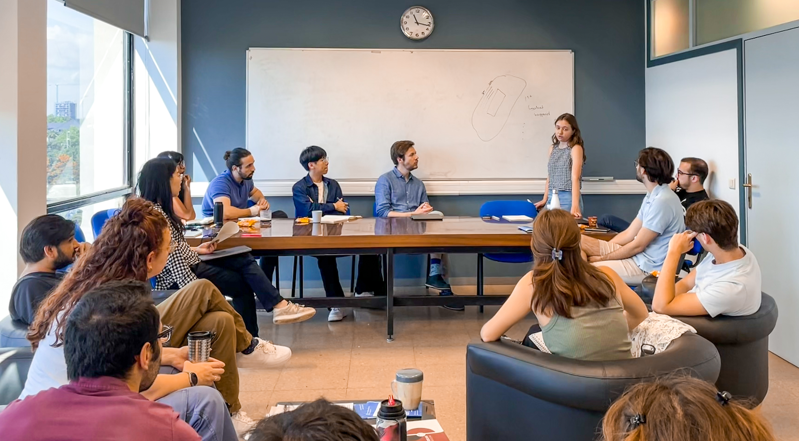

I initiate and organize academic activities with the goal of creating shared value for the community.

Below are some selected activities I am proud of. If you’re interested in organizing similar events, feel free to reach out—I’d be happy to share my experience! (Click each to expand.)

  

    <b>1. BESTEPS</b> (Barcelona Essential Skills Training for Economics PhD Students)

  

    
 
      <figure>
         
        <figcaption>Fig. BESTEPS Opening Lecture</figcaption> 
      </figure>
    

  

  

  
BESTEPS provides PhD students with comprehensive guidance for <b>key stages of a research project</b>. Through expert-led lectures, the program empowers participants to take the "best steps" toward conducting rigorous research efficiently. (<a href="https://www.ub.edu/school-economics/kick-off-of-the-besteps-with-antonio-cabrales/" target="_blank">UBSE News on the Launch of BESTEPS</a>)

  
BESTEPS is financed by a <a href="https://web.ub.edu/en/web/escola-doctorat/" target="_blank">EDUB-funded project</a> for which I am the grant recipient, running during academic years 2024/25 and 2025/26. The design and organization of the program is a joint effort with my PhD colleagues and the <a href="https://www.ub.edu/school-economics/" target="_blank">UBSE</a> staff.

  
BESTEPS consists of 7 Lectures taught by renowned scholars:

  <ul>
    <li><b>Opening Lecture:</b> <a href="https://www.linkedin.com/feed/update/urn:li:activity:7295739310534717440/" target="_blank">Workflows of Economics Research</a> (Prof. Antonio Cabrales)</li>
    <li><b>Lecture 1:</b> <a href="https://lin-mengwei.github.io/activities" target="_blank">Starting a Feasible Project: Ideas, Literature, Exploratory Analysis</a> (Prof. Libertad Gonzalez)</li>
    <li><b>Lecture 2:</b> <a href="https://lin-mengwei.github.io/activities" target="_blank">Doing Organized and Replicable Research</a> (TBD)</li>
    <li><b>Lecture 3:</b> <a href="https://lin-mengwei.github.io/activities" target="_blank">Making Research Vivid: Visualization Practices</a> (Prof. Dirk Foremny & TBD)</li>
    <li><b>Lecture 4:</b> <a href="https://lin-mengwei.github.io/activities" target="_blank">Communicating Research 1: Presentations, Posters and Elevator Pitches</a> (TBD)</li>
    <li><b>Lecture 5:</b> <a href="https://lin-mengwei.github.io/activities" target="_blank">Communicating Research 2: Abstract, Introduction and Conclusion</a> (TBD)</li>
    <li><b>Closing Lecture:</b> <a href="https://lin-mengwei.github.io/activities" target="_blank">Publication Experiences: Mindset and Strategy</a> (TBD)</li>
  </ul>
   

 

  

    <b>2. Research Ideas Coffee Talk</b>

  

    
 
      <figure>
         
        <figcaption>Fig. PhD Ideas Coffee Session</figcaption> 
      </figure>
    

  

  

  
The Ideas Coffees are designed for PhD students and Postdocs to talk about <b>newly formed immature ideas</b> in a safe and friendly environment. The main objectives are to receive feedback before starting a project, understand each others' research interests, and foster collaboration. We also host occasional special sessions (e.g., sharing data info). (See: <a href="https://www.linkedin.com/posts/universitat-de-barcelona-school-of-economics_yesterday-we-concluded-the-final-session-activity-7275801743379046401-EGbN/" target="_blank">Our event post, Dec. 2024</a>)

  
This is an innovative event series for junior Economics researchers at <a href="https://www.ub.edu/school-economics/" target="_blank">UBSE</a>, which I initiated with IEB PhD colleagues in 2024. It has received invaluable support from the PhD in Economics Program. I have been in charge of the series in academic years 2023/24 and 2024/25.

   

 

  

    <b>3. Job Market Preperation Process Improvement Plan</b> 
  

    
 The plan aims to better prepare PhD program candidates for the job market by offering a comprehensive set of activities, including information sessions, planning meetings, package tutoring, mock interviews, mock job market talks. The proposal of this plan was development with the invaluable support and advice from <a href="https://mariebeigelman.github.io/" target="_blank">Marie Beigelman</a> and <a href="https://abhinavkhemka.com" target="_blank">Abhinav Khemka</a>. It was approved by th Academic Committee and has been implemented since the academic year 2024/25.

 

  
<b>4. Applied Econometric Methods Reading Group</b>

  
The reading group meets regularly to share new methodological advancements in applied micro. We aim to cover <b>newly-developed causal inference methods</b> that are not yet commonly taught in a standard graduate-level econometrics course. I work with <a href="https://ieb.ub.edu/en/researcher/blanco-pineiro-sergio/" target="_blank">Sergio Blanco</a>, the coordinator of the group, and others in planning and organizing the activity.

  
<b>Topics in 2025 (TBD) include:</b>

  <ul>
    <li>Shift-share & Recentered Instruments</li>
    <li>Staggered DID with Continuous Treatments</li>
    <li>Difference in Discontinuities</li>
    <li>...</li>
  </ul>
   

