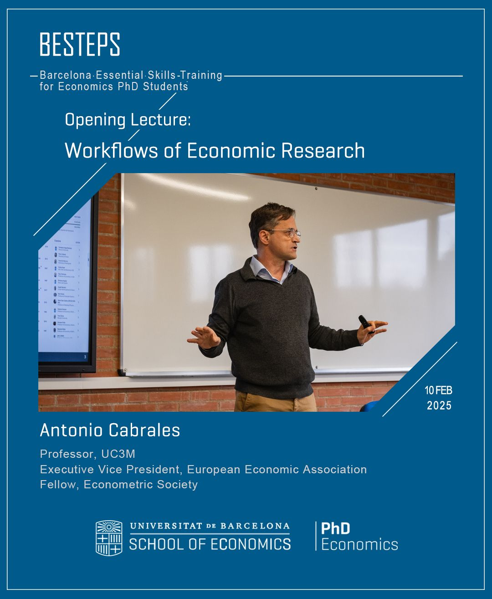
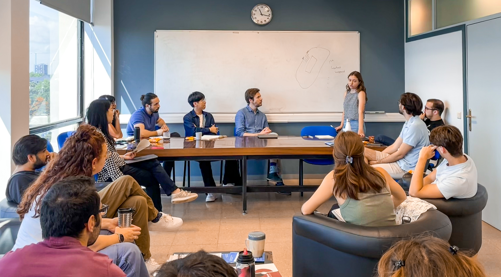
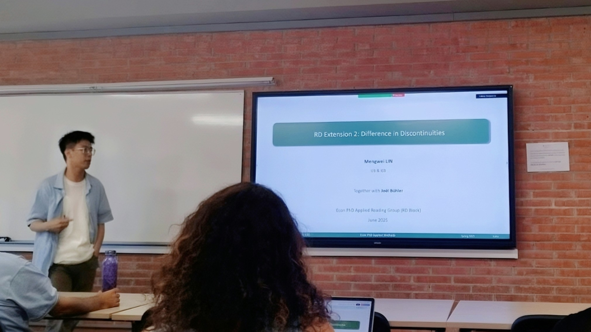

I initiate and organize academic activities with the goal of creating shared value.

Below are some selected activities I am proud of. I'm happy to share my organizational experience; feel free to reach out! (Click each to expand.)

  

    <b>1. BESTEPS</b> (Barcelona Essential Skills Training for Economics PhD Students)

  

    
 
      <figure>
         
        <figcaption>Fig. BESTEPS Opening Lecture</figcaption> 
      </figure>
    

  

  

  
Through expert-led lectures, BESTEPS offers PhD students necessary guidance to take "best steps" in different <b>key stages of a research project</b>. (<a href="https://www.ub.edu/school-economics/kick-off-of-the-besteps-with-antonio-cabrales/" target="_blank">UBSE News on the Launch of BESTEPS</a>)

  
BESTEPS is financed by a <a href="https://web.ub.edu/en/web/escola-doctorat/" target="_blank">EDUB-funded project</a> for which I am the grant recipient, running during academic years 2024/25 and 2025/26. This program is a joint effort with my amazing colleagues.

  
BESTEPS consists of 7 Lectures taught by renowned scholars:

  <ul> <strong>Part I: Set Up A Research Project</strong>
    <li><b>Opening Lecture:</b> <a href="https://www.linkedin.com/feed/update/urn:li:activity:7295739310534717440/" target="_blank">Workflows of Economics Research</a> (Prof. Antonio Cabrales)</li>
    <li><b>Lecture 1:</b> <a href="https://www.linkedin.com/feed/update/urn:li:activity:7310955533031682048/" target="_blank">Starting a Feasible Project: Ideas, Literature, Exploratory Analysis</a> (Prof. Libertad Gonzalez)</li>
    <li><b>Lecture 2:</b> <a href="https://lin-mengwei.github.io/activities" target="_blank">Doing Organized and Replicable Research</a> (Prof. Joan Llull, Data Editor of Econometrica)</li>
  </ul>
  <ul> <strong>Part II: Research Products</strong>
    <li><b>Lecture 3:</b> <a href="https://lin-mengwei.github.io/activities" target="_blank">Graphical Communication: Visualization Practices</a> (Prof. Dirk Foremny & TBD)</li>
    <li><b>Lecture 4:</b> <a href="https://lin-mengwei.github.io/activities" target="_blank">Communicating Research: Presentations, Posters and Elevator Pitches</a> (TBD)</li>
    <li><b>Lecture 5:</b> <a href="https://lin-mengwei.github.io/activities" target="_blank">Communicating Research: Crafting a Job Market Paper</a> (TBD)</li>
    <li><b>Closing Lecture:</b> <a href="https://lin-mengwei.github.io/activities" target="_blank">Publication Experiences: Mindset and Strategy</a> (TBD)</li>
  </ul>
   

 

  

    <b>2. Research Ideas Coffee Talk</b>

  

    
 
      <figure>
         
        <figcaption>Fig. PhD Ideas Coffee Session</figcaption> 
      </figure>
    

  

  

  
The Ideas Coffees are biweekly sessions, designed for PhD students and Postdocs to talk about <b>newly formed immature ideas</b> in a safe and friendly environment. The main objectives are to receive feedback before starting a project, understand each others' research interests, and foster collaboration. We also host occasional special sessions (e.g., to share data info). 
 

  
This is an innovative event series for junior Economists at <a href="https://www.ub.edu/school-economics/" target="_blank">UBSE</a>, which I initiated with IEB PhD colleagues in Spring 2024. It has received great support from the PhD in Economics Program. I am in charge of the series for AY 2023/24 and 2024/25. (See: <a href="https://www.linkedin.com/posts/universitat-de-barcelona-school-of-economics_economics-phd-research-activity-7316368944271962113-dzn8/" target="_blank">Our recent event post</a>)

   

 

  

    <b>3. Job Market Preperation Process Improvement Plan</b> 
  

    
 The plan <b>better prepares PhD candidates for the Job Market</b> through information sessions, personalized planning meetings, package tutoring, mock interviews, mock job market talks, etc. It was developed with invaluable input from JM candidates ahead of me, such as <a href="https://mariebeigelman.github.io/" target="_blank">Marie Beigelman</a>, <a href="https://abhinavkhemka.com" target="_blank">Abhinav Khemka</a>, Marianna Magagnoli, Alex Izquierdo, among others. The plan was approved by th Academic Committee, and has been implemented since the academic year 2024/25.

     

 

  
<b>4. Applied Econ Methods Reading Group</b>
  
  

    
 
      <figure>
         
        <figcaption>Fig. Applied Econ Reading Group</figcaption> 
      </figure>
    

  

  

  
The reading group meets monthly to share new methodological advancements in applied micro. We aim to cover <b>newly-developed causal inference methods</b> that are not yet commonly taught in a standard graduate-level econometrics course. It is planed and organized by Sergio Blanco, Cristina Aranzana,  Cecilia Ramirez, and myself, and supported by the Department of Public Economics and the IEB.

  
<b>Methods in 2025 (TBD) include:</b>

  <ul>
    <li>Shift-share & Recentered Instruments</li>
    <li>Staggered DID with Continuous Treatments</li>
    <li>Difference in Discontinuities</li>
    <li>...</li>
  </ul>
   

